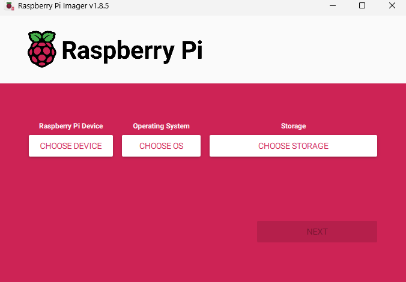
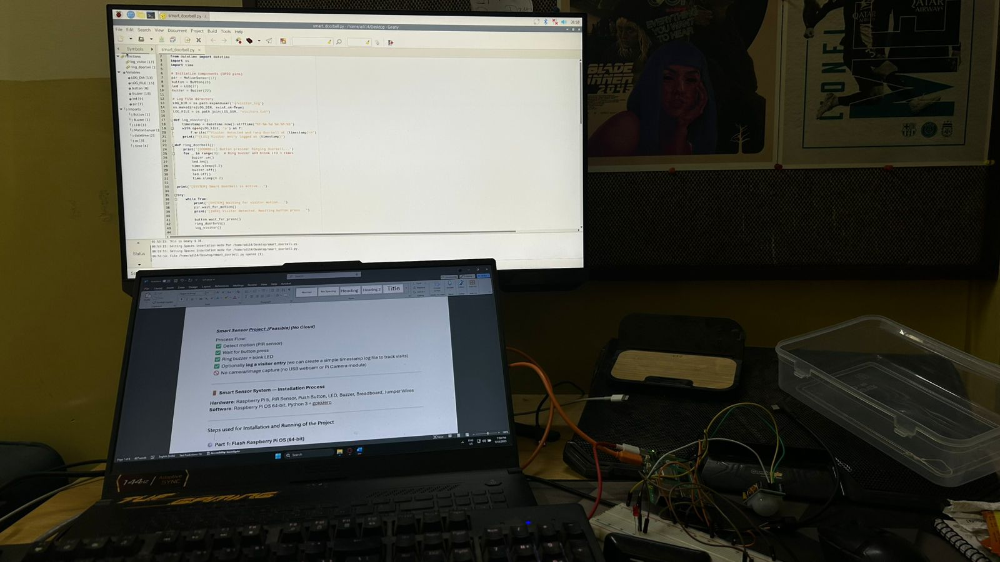
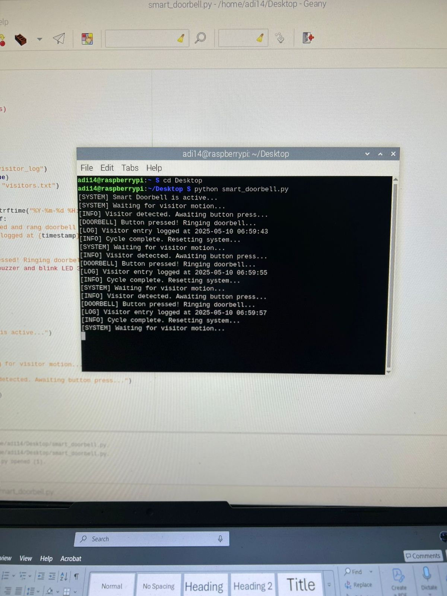
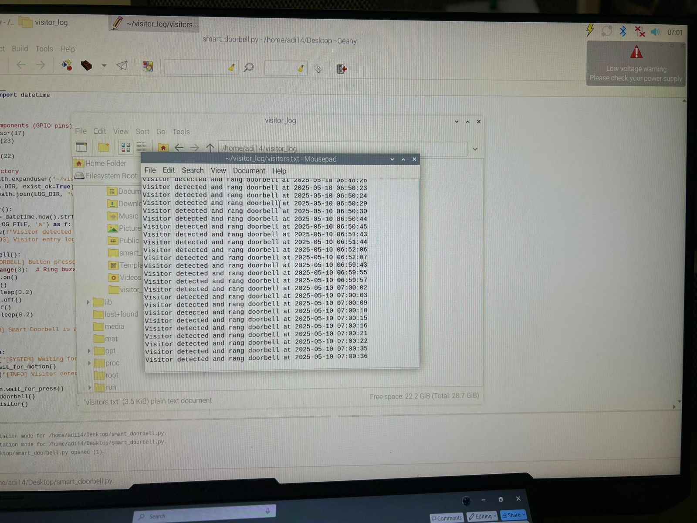

# 📡 Smart Sensor System (Feasible)🚪🔔

A simple **Raspberry Pi5-based smart sensor system** that detects visitor motion (via PIR sensor), waits for a button press, rings a buzzer with LED blink, and logs visitor entries — **no cloud, no camera**.

---

## 🛠️ Hardware Used

| Component | Raspberry Pi Pin |
| --------- | ---------------- |
| PIR OUT   | GPIO 17          |
| Button    | GPIO 23 ↔ GND    |
| Buzzer    | GPIO 22 ↔ GND    |
| LED       | GPIO 27 ↔ GND    |

* **Board:** Raspberry Pi 5
* **Other:** Breadboard, Jumper Wires

> ⚠️ **No resistors used** — LED/Buzzer powered via 3.3V GPIO safely (short ON time and lack of Resistors).

## Hardware Prototype

This is the hardware setup of our project using Raspberry Pi, PIR sensor, and basic electronic components (LED, resistor, push button) on a breadboard.


---

## 💻 Software Used

* Raspberry Pi OS (64-bit Desktop)
* Python 3
* gpiozero (GPIO library)

This is the hardware setup of our project using Raspberry Pi, PIR sensor, and basic electronic components (LED, resistor, push button) on a breadboard.



---

## ⚙️ Project Setup Instructions

### Part 1️⃣ — Flash Raspberry Pi OS

```bash
# On your laptop:
1. Download Raspberry Pi Imager
2. Flash Raspberry Pi OS (64-bit)
3. (Optional) Enable SSH by creating an empty file named 'ssh' in boot partition (I used it for Setup)
```

### Part 2️⃣ — Boot Raspberry Pi & Configure

```bash
# Insert SD card & power on Pi
# (Optional) SSH into Pi:
ssh pi@raspberrypi.local  # default password: raspberry (Use the Local name you used while setting up)
```

### Part 3️⃣ — Install Essentials

```bash
sudo apt update && sudo apt upgrade -y
sudo apt install python3-pip python3-gpiozero -y
```

### Part 4️⃣ — Setup Project Code

```bash
mkdir ~/smart_doorbell
cd ~/smart_doorbell
nano smart_doorbell.py
```

> Copy-paste the full project code from [smart\_doorbell.py](smart_doorbell.py)

### Part 5️⃣ — Hardware Connections

Wire the components as per the table above. 

---

## ▶️ Running the Smart Doorbell System

```bash
cd ~/smart_doorbell
python3 smart_doorbell.py
```

### 🛠️ Test Workflow

| Action               | Expected Result                                    |
| -------------------- | -------------------------------------------------- |
| Walk in front of PIR | Console prints "Visitor detected"                  |
| Press Button         | Buzzer rings + LED blinks 3×                       |
| Visitor Log          | Entry saved in `/home/pi/visitor_log/visitors.txt` |

---

## 🚀 (Optional) Auto-start on Boot

```bash
crontab -e
```

> Add this line at the end:

```bash
@reboot python3 /home/pi/smart_doorbell/smart_doorbell.py
```

---

## ✅ System Features Summary

| Feature                   | Status |
| ------------------------- | ------ |
| PIR detects motion        | ✅      |
| Button rings buzzer + LED | ✅      |
| Visitor event is logged   | ✅      |
| System auto-resets        | ✅      |
| No camera used            | ✅      |

---

## 📂 Project Structure

```bash
smart_doorbell/
├── smart_doorbell.py
└── visitor_log/
    └── visitors.txt
```

---

## 📸 Project Gallery (Example Images)







---

## 📋 License

This project is released under the MIT License.

---

## 🙌 Acknowledgements

* Raspberry Pi Foundation
* gpiozero Library

> *It was Fun Building my First IoT Project!* 🚪🔔✨
